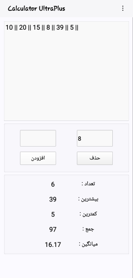
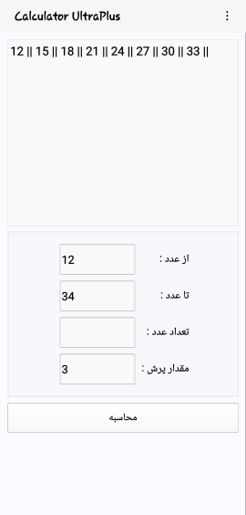
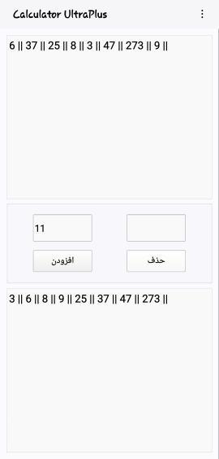
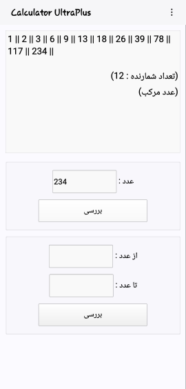
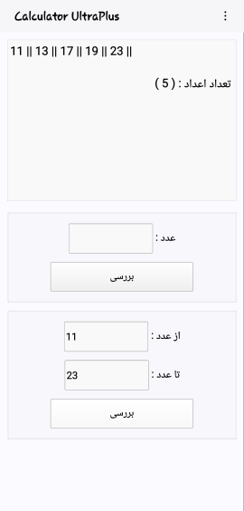
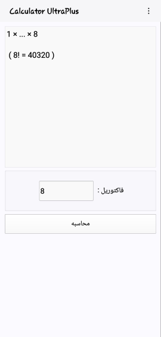
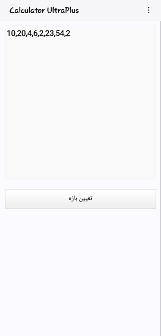
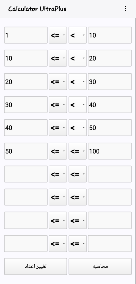
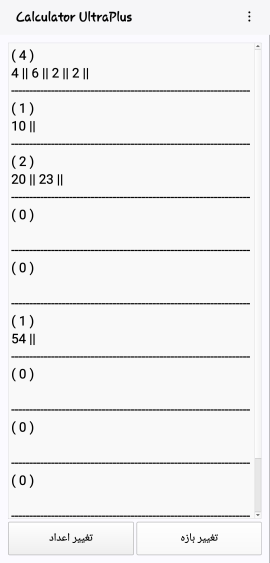
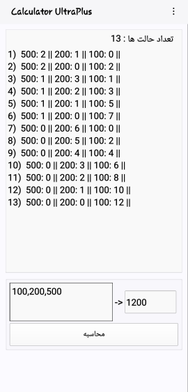

# Calculator-UltraPlus

This project is an advanced calculator that performs specific tasks which, while possible with a regular calculator, are not straightforward.

## Program Tools

1. Simultaneously calculate the average, minimum, and maximum of a set of numbers.
2. Display a series of numbers with a specified difference.
3. Sort numbers from smallest to largest.
4. Check if a number is prime or composite and display prime numbers within a range.
5. Calculate the factorial of a number.
6. Sort numbers within specified ranges.
7. Create a specific amount of money using different coin denominations.
 

> [!NOTE]\
> This program is designed based on the size and design of the phone and Android.

---
 

